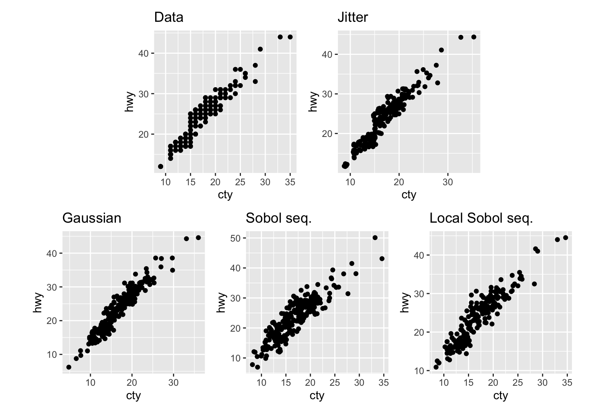

`jitter2D` package
======================
Natalia da Silva, Ignacio Alvarez-Castro & Dianne Cook


# 


## Overview

`jitter2D` is an R package that extends ggplot2 to create bivariate jittered scatterplots. This package provides specialized functionality for adding controlled random noise in two dimensions, making it easier to visualize overlapping data points in scatterplots where both x and y variables may have discrete or semi-discrete values.

## Description

When creating scatterplots with discrete or rounded data, points often overlap, making it difficult to assess the true density and distribution of observations. While base R and ggplot2 provide one-dimensional jittering (typically along one axis), `jitter2D` extends this concept to apply jittering simultaneously to both x and y coordinates.

Currently there are two implemented methods:

- `geom_jitter_gauss`: Adds Bivariate Gaussian random noise 

- `geom_jitter_quasi`:  Adds Quasi-random noise based on Sobolev sequences

## Installation

You can install the development version of jitter2D from GitHub:

```r
# Install devtools if you haven't already
install.packages("devtools")

# Install jitter2D from GitHub
devtools::install_github("natydasilva/jitter2D")
```

## Usage

### Basic Example


| ash | beg | count |
|:---:|:---:|:-----:|
| 1.5 | 1.5 |   5   |
|  3  |  2  |   3   |
|  3  |  4  |   2   |
| 4.5 |  5  |   1   |
| 5.5 |  6  |   1   |

```r

data(dayles)

base <- ggplot(dayles, aes(x = ash, y = beg)) +
  geom_point(col = 'red', size = .8)

p1 <- base + geom_jitter() + labs(title = 'Jitter') + theme(aspect.ratio = 1)
p2 <- base + geom_jitter_gauss() + labs(title = 'Gaussian')  + theme(aspect.ratio = 1)
p3 <- base + geom_jitter_quasi() + labs(title = 'Sobol seq.')+ theme(aspect.ratio = 1)
p4 <- base + geom_jitter_quasiloc() + labs(title = 'Local Sobol seq.') + theme(aspect.ratio = 1)


(p1 + p2) / (p3 + p4)
```


### mpg Example


```r
library(ggplot2)
library(jitter2D)
library(patchwork)

data(mpg)

p <- mpg |> ggplot(aes(x = cty, y = hwy))

p0 <- p + geom_point() + theme(aspect.ratio = 1) + labs(title = 'Data')


p2 <- p +
  geom_jitter_gauss() +
  theme(aspect.ratio = 1) +
  labs(title = 'Gaussian')

p1 <- p + geom_jitter() + theme(aspect.ratio = 1) + labs(title = 'Jitter')

p3 <- p + geom_jitter_quasi() + theme(aspect.ratio = 1) + labs(title = 'Sobol seq.')

p4 <- p + geom_jitter_quasiloc() + theme(aspect.ratio = 1) + labs(title = 'Local Sobol seq.')
  


(p0 + p1) / (p2 + p3+p4) 

```



## To Do list

- Improve quasi random implemantation

- Work in the pkg documentation and webpage 

- Experiment to evaluate different methods

- Find an interesting real data example


